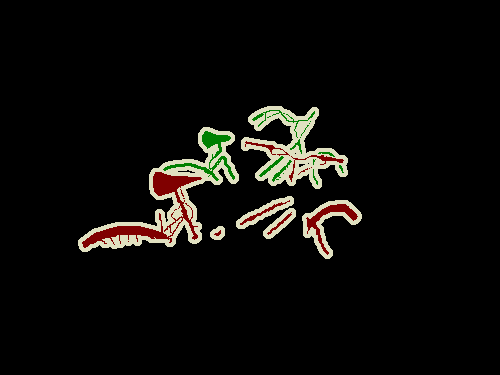
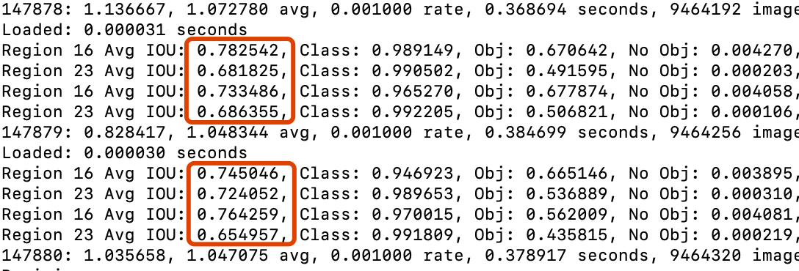
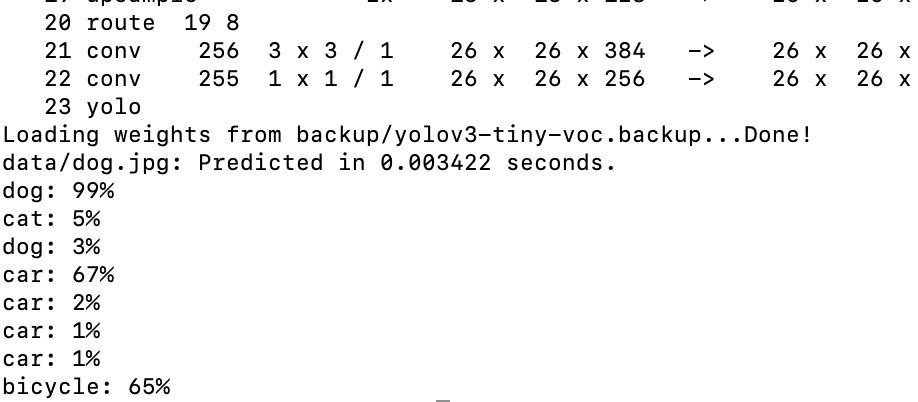
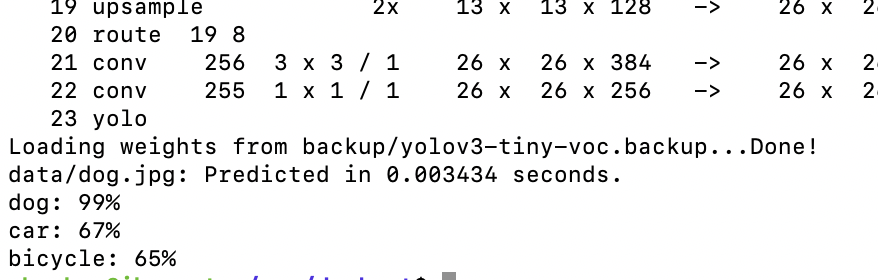

# yolo笔记1——训练和测试voc
### 1.编译
修改Makefile [人穷，没显卡，都改为0吧]

```
GPU=0
CUDNN=0
OPENCV=0
OPENMP=0
DEBUG=0
```
然后make即可
### 2.下载VOC数据
VOC数据集，是一组图片，每张图片有1个或多个物体，总共对20类物体做了标记
标记的方式是：所在的框，曲线区域（抠图）
```
wget https://pjreddie.com/media/files/VOCtrainval_11-May-2012.tar
wget https://pjreddie.com/media/files/VOCtrainval_06-Nov-2007.tar
wget https://pjreddie.com/media/files/VOCtest_06-Nov-2007.tar
tar xf VOCtrainval_11-May-2012.tar
tar xf VOCtrainval_06-Nov-2007.tar
tar xf VOCtest_06-Nov-2007.tar
```
可得到VOCdevkit文件夹
### 3.生成标签
原始的VOC数据是有很多内容的
```
zhouhua@xbox:~/voc$ ls VOCdevkit/
VOC2007  VOC2012
zhouhua@xbox:~/voc$ ls VOCdevkit/VOC2012/
Annotations  ImageSets  JPEGImages  labels  SegmentationClass  SegmentationObject
```
可见有2组数据，每组数据内都有

```
Annotations
ImageSets
JPEGImages
labels
SegmentationClass
SegmentationObject
```
这几个文件夹,其中，ImageSets / SegmentationClass / SegmentationObject 是我们用不到的，里面是一些图像名称信息和抠图的区域信息，类似入下：



我们只用到了JPEGImages Annotations 这两个文件夹，因为里面的xml有我们需要的每张图种含有的物体类，和物体位置矩形框。
执行如下：

```
zhouhua@xbox:~/voc$ ls VOCdevkit/
VOC2007  VOC2012
zhouhua@xbox:~/voc$ python darknet/scripts/voc_label.py 
```
静候片刻，会在labels目录生成许多与图像名称对应的.txt文件，其内容如下：

```
zhouhua@xbox:~/voc$ cat VOCdevkit/VOC2012/labels/2011_001223.txt 
19 0.417417417417 0.408 0.144144144144 0.084
19 0.617117117117 0.416 0.165165165165 0.092
8 0.614114114114 0.646 0.429429429429 0.312
8 0.228228228228 0.611 0.318318318318 0.306
8 0.797297297297 0.572 0.165165165165 0.26
```
共5列，第一列是所属的类别，数名此图种含有5个物种，后面的四个数字分别是x,y,width,height，对宽高做了归一化。
### 4.准备训练参数
共涉及到4个文件
#### train.txt
内含所有待训练的jpg图片的绝对路径
```
/home/zhouhua/voc/VOCdevkit/VOC2007/JPEGImages/000012.jpg
/home/zhouhua/voc/VOCdevkit/VOC2007/JPEGImages/000017.jpg
/home/zhouhua/voc/VOCdevkit/VOC2007/JPEGImages/000023.jpg
/home/zhouhua/voc/VOCdevkit/VOC2007/JPEGImages/000026.jpg
/home/zhouhua/voc/VOCdevkit/VOC2007/JPEGImages/000032.jpg
/home/zhouhua/voc/VOCdevkit/VOC2007/JPEGImages/000033.jpg
/home/zhouhua/voc/VOCdevkit/VOC2007/JPEGImages/000034.jpg
......
```
#### voc.names
所有物种的名称列表
```
zhouhua@xbox:~/voc$ cat darknet/data/voc.names 
aeroplane
bicycle
bird
boat
bottle
bus
car
cat
......

```


#### voc.data  
指定物种类别数，train.txt文件路径，物种名称文件路径，模型训练中途关机备份weights的路径
```
zhouhua@xbox:~/voc$ cat darknet/cfg/voc.data 
classes= 20
train  = /home/zhouhua/voc/train.txt
names = data/voc.names
backup = backup
```
#### yolov3-tiny-voc.cfg 
这个是网络模型文件，决定了网络的结构和训练网络的参数

```
zhouhua@ihoment:~/voc/darknet$ cat cfg/yolov3-tiny-voc.cfg 
[net]
#Testing
batch=1
subdivisions=1
#Training
#batch=64
#subdivisions=2
......
```

注意：复制一个新的yolov3-tiny-voc2.cfg，并修改它为如下所示,因为训练和正式使用需要用的batch是不同的
```
zhouhua@xbox:~/voc/darknet$ cat cfg/yolov3-tiny-voc2.cfg 
[net]
#Testing
#batch=1
#subdivisions=1
#Training
batch=64
subdivisions=2
......
```
### 5.开始训练
`./darknet detector train cfg/voc.data cfg/yolov3-tiny-voc2.cfg`
然后可以看到IOU在不断增加

如果中途不小心down机了，没关系，继续从关机前的位置训练
`./darknet detector train cfg/voc.data cfg/yolov3-tiny-voc2.cfg backup/yolov3-tiny-voc2.backup`

### 6.训练到一半也可以看效果
`./darknet detector test cfg/voc.data cfg/yolov3-tiny-voc2.cfg backup/yolov3-tiny-voc2.backup data/dog.jpg -thresh 0.01`




如果你觉得框的太多了，就降低阈值吧：
`./darknet detector test cfg/voc.data cfg/yolov3-tiny-voc2.cfg backup/yolov3-tiny-voc2.backup data/dog.jpg -thresh 0.1`




